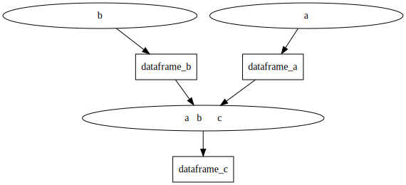

# pandas_graph
Pandasを使った計算プログラムをメンテナンスしやすくするためのライブラリ。

このライブラリでは関数とデータフレームのグラフとして計算プログラムを構築する。
関数は0個以上のデータフレームを入力に取り0個以上のデータフレームを出力する。

関数間の依存関係はライブラリが解決する。



# インストール方法
```bash
pip install git+https://github.com/tokno/pandas_graph.git
```

# 使い方
## 関数の定義
```python
import pandas as pd
import pandas_graph as pg

@pg.function(
    name='データフレームaとbからcを作る関数',
    inputs=[
        pg.input(id='dataframe_a'),
        pg.input(id='dataframe_b'),
    ],
    outputs=[
        pg.output(
            id='dataframe_c',
            description=''
        ),
    ]
)
def create_c(dataframe_a, dataframe_b):
    return [
        pd.merge(dataframe_a, dataframe_b, left_index=True, right_index=True),
    ]
```

## 実行
```python
import pandas_graph as pg

registry = pg.FunctionRegistry()
registry.add(a_source)

graph = registry.create_graph()
result = graph.execute()
```

## ドキュメントの生成
```python
graph = registry.create_graph()
graph.generate_document("path/to/markdown", "path/to/output")
```

以下のようなドキュメントが生成される。


